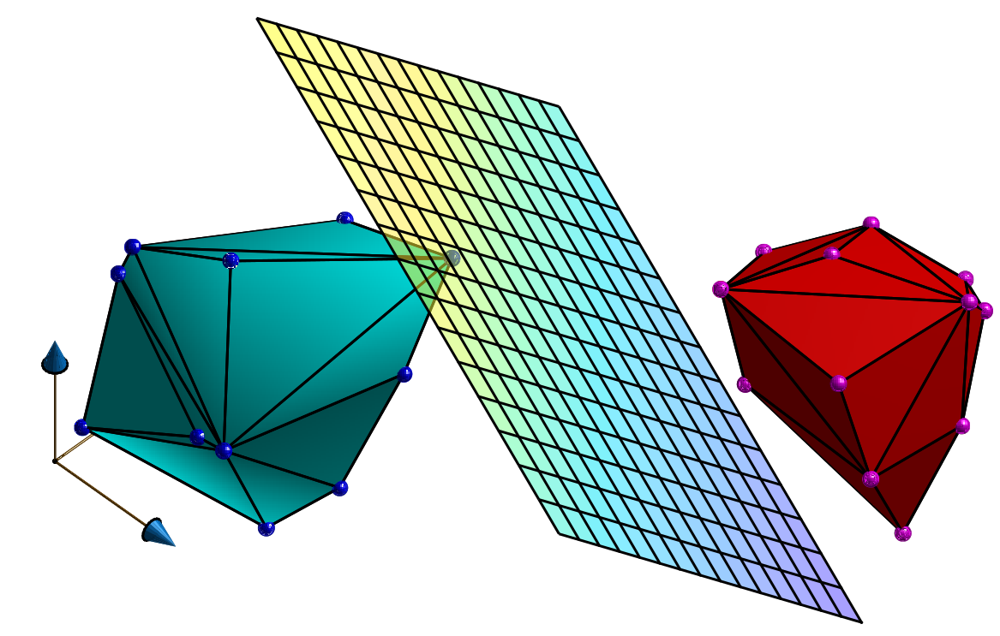

Separator Library
========================

 

This library allows you to solve the Linear Program to obtain the plane that separates two sets of points in 3D. Unfeasibility of the problem means that the two sets of points are not linearly separable. Note that this library simply finds **one** of the possible planes that separate the two sets of points (i.e. it does not optimize the distance as in the [SVM problem](https://en.wikipedia.org/wiki/Support_vector_machine)).

One possible application of this library is to test if two polyhedra are in collision or not (by simply checking if the LP problem that separates theirs vertexes is feasible or not). In case of feasibility, a plane that separates these polyhedra will also be returned


## Citation

When using this library, please cite this paper (to appear):

```bibtex
@article{tordesillas2020mader,
  title={{MADER}: Trajectory Planner in Multi-Agent and Dynamic Environments},
  author={Tordesillas, Jesus and How, Jonathan P},
  journal={arXiv preprint},
  year={2020}
}
```

## Instructions

```
mkdir ws && cd ws && mkdir src && cd src
git clone https://github.com/mit-acl/separator.git
cd ..
catkin config -DCMAKE_BUILD_TYPE=Release
catkin build
```

The backened solver [GLPK](https://www.gnu.org/software/glpk/) will be downloaded and installed when executing `catkin build` ( You can also install int manually by following the instructions located [here](https://en.wikibooks.org/wiki/GLPK/Linux_OS#Install)). The GLPK Reference Manual (and its API documentation) is available [here](http://www.chiark.greenend.org.uk/doc/glpk-doc/glpk.pdf).

## Sample Usage in another ROS package

In its CMakeLists.txt add the library name to `find_package()`.

```cmake
find_package(catkin REQUIRED COMPONENTS separator)
```

Example: see test_separator.cpp

## Credits
Part of the code is based on the ACL [motoralloc library](https://gitlab.com/mit-acl/creare-labdrone/motoralloc).
